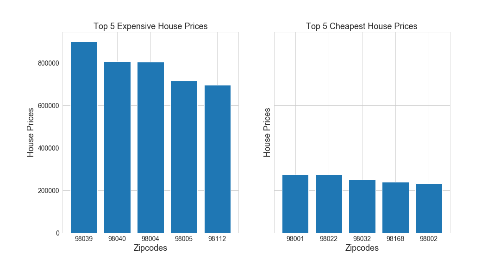
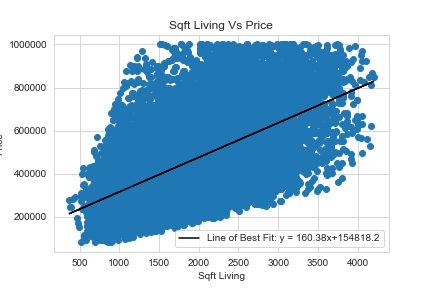

# Modeling King County House Prices
## Flatiron Housing Price Project

**Authors**: Andy Peng

The contents of this repository detail an analysis of the module one project. This analysis is detailed in hopes of making the work accessible and replicable.


### Business problem:

I am tasked to investigate housing prices for a company that is focus on finding affordable family houses in the kings county area. For this project we will be using the Kings County Housing Sales dataset to investigate different features that might affect the housing prices. By using the kc_house_data.csv dataset we will be trying to find certain features that we should keep our eyes out to get the best prices for family houses.


### Data
Data can include house prices and features of houses such as zip code, number of bedrooms, number of bathrooms, etc.


## Methods
- descriptive analysis
- choices made
- key relevant findings from exploritory data analysis

## Results


#### Visual 1

> Box plot graph of Water Front View VS House Prices

#### Visual 2

> Zip Code's Average Housing Prices

#### Visual 3

> Mapping of Zip Code's Average Housing Prices

#### Visual 4

> Footage of the house vs Housing Prices


## Recommendations:

To summarize everything above, we created a model that manages to predict housing prices within a $80,000 range. We chose to explore the features waterfront view, zipcode and sqft_living. Below shows the exploration results from the code above.

1) Houses with no waterfront view have a lower average in housing prices.

2) Zipcodes around certain locations such as Mercer Island tend to cost more than houses away from Mercer Island.

3) The bigger the footage of the home is the more expensive the housing price is.


## Limitations & Next Steps

There are many features that we haven't considered. For example 


### For further information
Please review the narrative of our analysis in [our jupyter notebook](./main_notebook.ipynb) or review our [presentation](./SampleProjectSlides.pdf)

For any additional questions, please contact **email, email, email)


##### Repository Structure:

Here is where you would describe the structure of your repoistory and its contents, for exampe:

```

├── README.md                       <- The top-level README for reviewers of this project.
├── main_notebook.ipynb             <- narrative documentation of analysis in jupyter notebook
├── presentation.pdf                <- pdf version of project presentation
└── images
    └── images                          <- both sourced externally and generated from code

```
